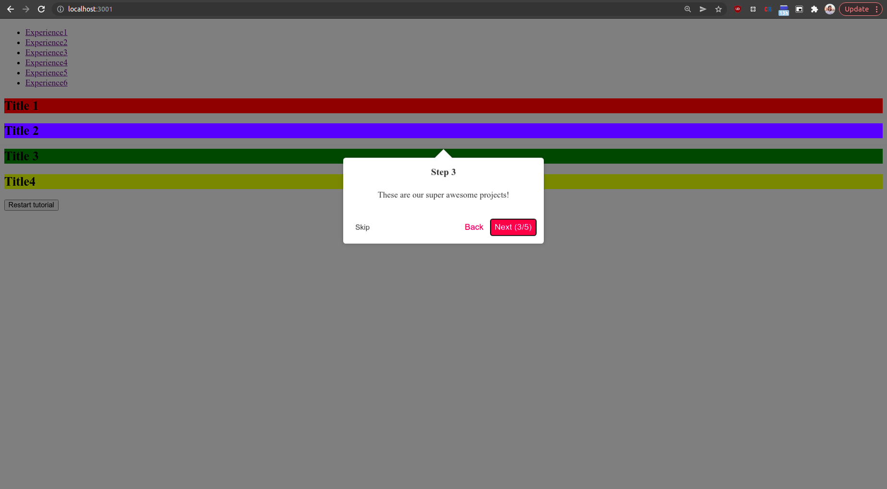

# LABORATORY-REACT-JOYRIDE



This laboratory regroups my experimentations and tests of the library `react-joyride`. This library allows you to create an interactive tutorial steps by step merging well with your UI. I created this project using **NX** for the workspace, **React** for the framework and obviously **react-joyride**.

## Plan of the presentation

I explain with all the details how I build the project and my way of working.

- [Experiences](#experiences)
- [Development](#development)
- [Running](#running)
- [System](#system)

## Experiences

- **Experience1:** Creating the simplest example possible
- **Experience2:** Playing with a monochrome example
- **Experience3:** Playing with the styles
- **Experience4:** Playing with the control props
- **Experience5:** Playing with the steps manually for creating an automatic tutorials
- **Experience6:** Trying to modify the component with a custom one

## Development

For using this library, I need to first install it in our package manager.

```bash
$ npm i react-joyride
```

Once done, I simply add it in the file containing my UI.

```js
import Joyride, { CallBackProps, STATUS, Step } from "react-joyride";
```

For implementing the steps, I used a state as follow:

```js
const [{ run, steps }, setState] = useState({
  run: true,
  steps: [
    {
      content: <h2>This is a test!</h2>,
      placement: "center",
      target: "body",
      title: "Step 1",
    },
    {
      content: "These are our super awesome projects!",
      target: ".first",
      title: "Step 2",
    },
    {
      content: "These are our super awesome projects!",
      target: ".second",
      title: "Step 3",
    },
    {
      content: "These are our super awesome projects!",
      target: ".third",
      title: "Step 4",
    },
    {
      content: "These are our super awesome projects!",
      target: ".fourth",
      title: "Step 5",
    },
  ],
});
```

The run indicate if I want the tutorial to run as soon as the component load and the steps are our tutorial. The Steps are actually links to other HTML element by the className in the target field.

Finally, I can add my Joyride element in the render:

```js
<Joyride
    callback={handleJoyrideCallback}
    continuous
    hideCloseButton
    run={run}
    scrollToFirstStep
    showProgress
    showSkipButton
    steps={steps as Step[]}
    styles={{
        options: {
        zIndex: 10000,
        },
    }}
/>
```

The callback function help to control what to do depending of the step and the status.

```js
const handleJoyrideCallback = (data: CallBackProps) => {
  const { status } = data;
  const finishedStatuses: string[] = [STATUS.FINISHED, STATUS.SKIPPED];

  if (finishedStatuses.includes(status)) {
    setState({ run: false, steps: steps });
  }
};
```

And Voila!
There are a lot of options possible for controlling the style, the steps and even the component itself. I try every possibilities available in my different experimentations. So feel free to dive into my different files!

## Running

I am using NX, so for starting the project use the following command:

```bash
$ nx serve app
```

For testing the app, use Postman.

## System

Ubuntu Version: Ubuntu 20.04.1 LTS
Node Version: v16.15.1

```bash
# Get the version of node
$ node -v

# Get the latest version of ubuntu
$ lsb_release -a
```
